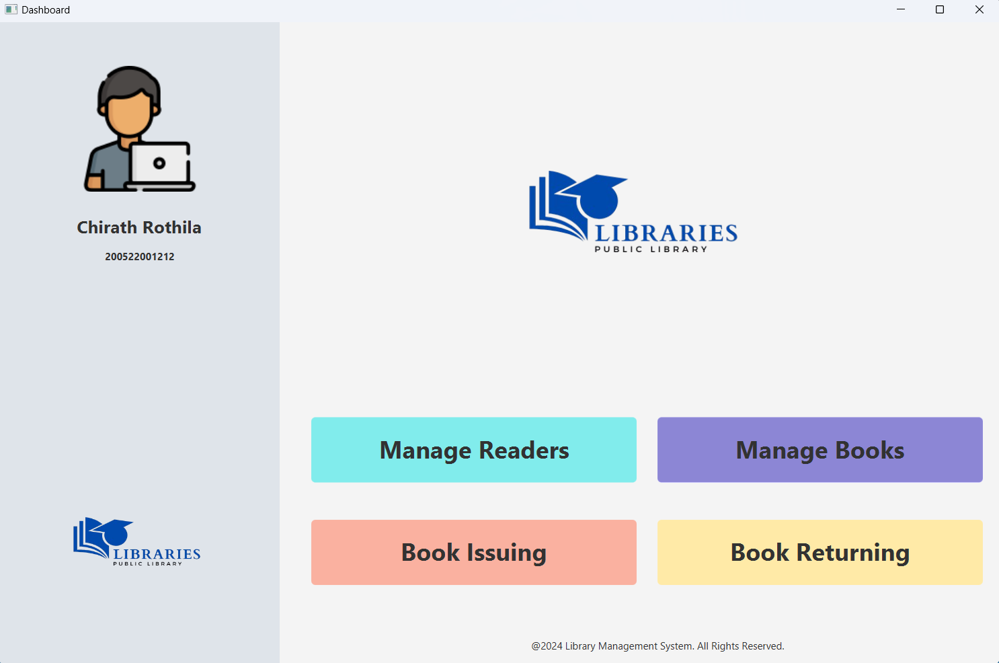

# 📚 Library Management System - Java Standalone App

A modern and user-friendly **Library Management System** built as a standalone Java application using **JavaFX**. This system allows librarians to efficiently manage books, members, borrowing records, and returns, all from a simple desktop interface.

---

## ✨ Features

- 🗂️ Manage Books (Add, Update, Delete)
- 👤 Member Registration & Management
- 🔄 Book Borrowing & Returning
- 📅 Due Date Tracking & Fine Calculation
- 🔍 Search & Filter Books and Members
- 💾 Local Database Integration (MySQL)
- 🎨 Modern UI using JavaFX

---

## 🛠️ Technologies Used

- **Java 17+**
- **JavaFX**
- **Scene Builder** (for FXML layouts)
- **MySQL** (for local database)

---

## 📸 UI Preview

### 🏠 Home UI

